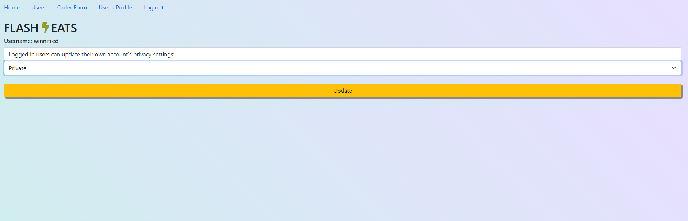

## Restaurant user management

## Quick Start
```bash
# Install dependencies
npm install
# Serve on localhost:3000
node server
# Run mongo db in another terminal
mongod
```
## Files that were modified from base code are
- server.js
- views folder(all fiels)
- public folder: style.css
- README.md
- package.json
( Every other files stayed the same )

> server.js
    - serve all requests
        '/'
        '/users'
        '/users/?name = somename'
        '/users/:userID'
        '/login'
        '/signup'
        '/logout'
        '/orderform.html'

    - use session to see if user is authorized

> views folder(pug files)
    home
    login
    signup
    userProfile
    users

## Limitation

## Screenshot




